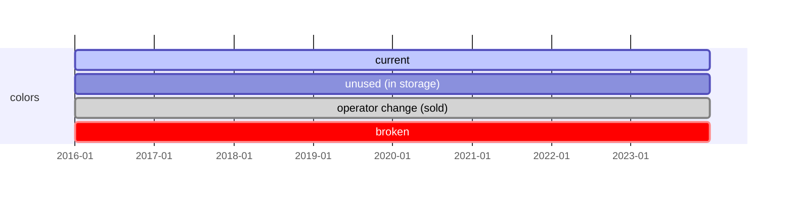

# RTF-0001: "Schematic Modular System"

## Description

RTF-0001 is a permanently evolving
[Eurorack](https://en.wikipedia.org/wiki/Eurorack) multi-case system and module
collection, producing current, control voltages and sound/musical transmissions.
Possible interactions with computers and/or other audio or visual based
artifacts. RTF-0001 has been known for being the source of some very specific
transmissions (███████) that had such a disturbing effect on the audience it led
to the creation of a dedicated B.O.M. research group.

Archives and timeline tend to prove the artifact has been carefully designed
over the years by it's main operator to produce self-sufficient audio
transmissions and maximize versatility, without locking it's potential operator
to a specific audio transmission genre:

- IDM
- Braindance
- Electronica
- Ambient
- Techno
- Avant-Garde
- Experimental
- Drum & Bass
- Drone
- Noise
- Breakbeat
- Acid
- House
- Acid House
- Trip-Hop
- Bass Music
- Digital Hardcore
- Dolphincore
- Elevator music

For reference, this document will also list transmission genres that are giving
inconsistent results with RTF-0001:

- Pirate songs
- Reggaeton
- Corsican polyphony
- Baroque Music
- Crabcore

**Important**

A disturbing analysis produced by the ███████-dedicated B.O.M. research group
stated that "RTF-0001 analysis, history and detailed specifications may consist
by themselves as a ███████ source" (quoted), which created a controversy inside
B.O.M. administration group and the public.

(see ████████████ for more information)

## Elements

*Main:*

- [ELM-0002](../../ELEMENTS/ELM-0002/README.md): "The Black Case"
- [ELM-0004](../../ELEMENTS/ELM-0004/README.md): "The Yellow Case"

*Additional:*

The artefact has been used in association with other elements during sandboxes:

- ELM-0001: "DigiDrums"
- ELM-0003: "Ethereal Waves"
- ELM-0005: "Spices"

## History

RTF-0001 first traces date back to 2015 with ELM-0002 discovery, but its
association with B.O.M. experiments only started in 2017 after ELM-0002
acquisition by SCHEMATiC WiZARD.

The following years were a succession of buying/selling transactions between OP
SW and other operators and corporations as such: [ [1] ](https://www.modularsquare.com/)
[ [2] ](https://www.thonk.co.uk/) [ [3] ](https://www.signalsounds.com/).
Many electronic components of ELM-0002 were bought second hand, some were DIY
kits assembled by SW.

RTF-0001 materials were initially self-contained / unitary with ELM-0002, but
after some years of experiments and module expansion, ELM-0004 was added to the
artifact, producing a versatile, complex yet transportable system.

For more information about the history of each independent element, please check
our archives:

- [ELM-0002: "The Black Case"
  (history)](../../ELEMENTS/ELM-0002/README.md#history)
- [ELM-0004: "The Yellow Case"
  (history)](../../ELEMENTS/ELM-0004/README.md#history)

After the introduction of ELM-0004 in the system, transmissions evolved to
something more complex and rich. Interactions between ELM-0002 and ELM-0004 are
native and seamless since both elements share the same Eurorack and formats,
though requiring longer patch cables. Each element/case found it's own function
in the whole system, yet preserving some possibility of "standalone" usage.

The ELM-0002 / ELM-0004 combo was self-sufficient, but used in combination with
ELM-0001 for percussive transmissions (2017), ELM-0003 for polyphony (2022) and
ELM-0005 for transmission body improvements (2022), RTF-0001 gained heavily in
versatility and coherence.

Human interaction with the artifact and protocol execution requires an
authorization + basic synthesis knowledge, that can be acquired on multiple
[places online](https://learningsynths.ableton.com/). Protocols can be found in
various SW archives and will be centralized in this repository as soon as
possible (see: sandboxes).

This page also keeps track of Eurorack modules that were once connected to
ELM-0002 or ELM-0004. Those modules are now locked up in B.O.M. storage
facilities, or may be now sitting in non-B.O.M. operator's systems.

## Timeline

```mermaid
---
displayMode: compact
---
gantt
  todayMarker off

  title         lifecycle
  dateFormat    YYYY-MM-DD
  axisFormat    %Y-%m

  section state
  research              :active,    2016-01-01, 2023-12-31
  prototype             :done,      2017-01-07, 2018-03-01
  v1.0.0                :done,      2018-03-01, 2022-06-10
  v2.0.0                :active,    2022-06-10, 2023-12-31

  section sandboxes
  sw_teststream                :milestone, 2017-02-19, 1d
  sw_modular_session__002      :milestone, 2018-02-11, 1d
  sw_modular_session__003      :milestone, 2018-02-13, 1d
  sw_modular_session__004      :milestone, 2018-02-18, 1d
  sw_modular_session__005      :milestone, 2018-04-16, 1d
  sw_modular_session__006      :milestone, 2018-05-20, 1d
  sw_modular_session__007      :milestone, 2019-06-16, 1d
  nullpart01                   :milestone, 2020-08-14, 2020-08-28
  nullpart01.garage            :milestone, 2021-02-06, 2021-02-07
  nullpart02                   :milestone, 2021-08-14, 2021-08-28
  nullpart03                   :milestone, 2022-08-14, 2022-08-28
  sw_live001.velvetmoon        :milestone, 2023-01-21, 1d
  sw_rehersal__sw_live002      :milestone, 2023-03-31, 1d
  sw_live002.gambettaclub      :milestone, 2023-03-31, 1d
  sw_live003.modularsquare     :milestone, 2023-04-13, 1d
  sw+mcfrsvn_research001       :milestone, 2023-07-07, 2d
  ricolidays01                 :milestone, 2023-07-24, 2023-07-31
  sw+th+briselame+csaoh_jam001 :milestone, 2023-08-10, 1d

  section updates
  [4ms] Pingable Enveloppe Generator            :done,          2017-02-14, 2018-11-04
  [Mutable Instruments] Braids                  :active,        2017-02-18, 2023-12-31
  [Mutable Instruments] Veils (v1)              :active,        2017-04-03, 2021-08-09
  [Mutable Instruments] Veils (v1)              : ,             2021-08-10, 2022-06-29
  [Mutable Instruments] Veils (v1)              :active,        2022-06-30, 2023-12-31
  [Mutable Instruments] Links                   :active,        2017-04-03, 2023-12-31
  [Doepfer] A-180-2 (multiple)                  :active,        2017-04-03, 2023-12-31
  [Xaoc] Belgrad                                :active,        2017-04-01, 2023-12-31
  [Intellijel] Dual ADSR                        : ,             2017-04-12, 2021-08-10
  [Make Noise] DPO                              : ,             2017-05-18, 2022-11-26
  [Bastl] Ciao!                                 :done,          2017-05-27, 2021-08-10
  [Mutable Instruments] Clouds                  :active,        2017-05-27, 2023-12-31
  [WMD] Aperture                                : ,             2017-08-12, 2021-08-10
  [Zvex] Fuzz Factory                           :active,        2017-08-12, 2023-12-31
  [Intellijel] Metropolis                       :done,          2017-09-04, 2020-10-01
  [Music Thing Modular] Mikrophonie (2017) DIY  :active,        2017-10-29, 2021-08-10
  [Music Thing Modular] Mikrophonie (2017) DIY  : ,             2021-08-10, 2022-12-05
  [Music Thing Modular] Mikrophonie (2017) DIY  :active,        2022-12-05, 2023-12-31
  [Music Thing Modular] Turing Machine MkII DIY : ,             2017-10-29, 2023-12-31
  [Music Thing Modular] Pulses DIY              : ,             2017-10-29, 2023-12-31
  [4ms] Rotating Clock Divider DIY              :crit,          2017-12-05, 2023-12-31
  [Noise Engineering] Basimilus Iteritas Alter  :active,        2017-12-10, 2023-12-31
  [ALM] Pamela's New Workout                    :active,        2017-12-16, 2023-12-31
  [Epoch Modular] Twin Peak                     :done,          2018-01-02, 2019-04-11
  Ornament & Crime                              :active,        2018-03-04, 2023-12-31
  [Mutable Instruments] Elements                :done,          2018-03-15, 2020-11-11
  [Erica Synths] Pico Drums                     :active,        2018-04-13, 2023-12-31
  [Malekko] Voltage Block                       :active,        2018-07-24, 2023-12-31
  [Make Noise] René 2                           :done,          2018-12-12, 2020-11-18
  [Make Noise] Maths                            :active,        2019-02-05, 2023-12-31
  [DivKid] Mutes (1) DIY                        :active,        2019-05-24, 2023-12-31
  [DivKid] Mutes (2) DIY                        :active,        2019-05-24, 2023-12-31
  [Fonitronik] Cascade DIY                      :active,        2019-05-24, 2023-12-31
  [Mutable Instruments] Plaits                  :active,        2019-06-01, 2023-12-31
  [Expert Sleepers] Disting Mk4 (1)             :active,        2019-08-15, 2023-12-31
  [Mutable Instruments] uGrid                   :done,          2020-02-10, 2021-02-11
  [XOR Electronics] Nerdseq                     :active,        2020-11-11, 2023-12-31
  [Robaux] SWT16+ DIY                           :active,        2020-11-11, 2023-12-31
  [Expert Sleepers] ES-8                        :active,        2020-11-11, 2023-12-31
  [2hp] Mix                                     :active,        2020-11-11, 2023-12-31
  [Mutable Instruments] Veils (v2)              :active,        2020-11-11, 2023-03-11
  [Expert Sleepers] Disting Mk4 (2)             :active,        2020-11-11, 2023-12-31
  [Doepfer] A-124 VCF5 (Wasp Filter)            :active,        2020-11-26, 2023-12-31
  [Doepfer] A-103 VCF6 (Low Pass Filter)        :active,        2020-11-26, 2023-12-31
  [Erica Synths] Pico DSP                       :active,        2020-11-26, 2023-12-31
  [XOR Electronics] Nerdseq Expander            :active,        2021-02-03, 2023-12-31
  [Intellijel] Quadrax                          :active,        2021-07-24, 2023-12-31
  [Happy Nerding] FX AID XL                     :active,        2021-07-24, 2023-12-31
  [Befaco] Hexmix                               :active,        2021-07-24, 2023-12-31
  [Befaco] Hexpander                            :active,        2021-07-24, 2023-12-31
  [Joranalogue] Filter 8                        :active,        2021-08-12, 2023-12-31
  [Happy Nerding] FX AID                        :active,        2021-08-12, 2023-12-31
  [2hp] Rnd v2                                  :active,        2021-08-12, 2023-12-31
  [Takaab] 2LPG (v2)                            :active,        2021-11-22, 2023-12-31
  [Qu-Bit] Databender                           :active,        2022-03-16, 2023-12-31
  [1010music] Bitbox Micro                      :active,        2022-04-02, 2023-12-31
  [Intellijel] Phones (1U)                      :active,        2022-04-25, 2023-12-31
  [Intellijel] Switched Multiple (1U)           :active,        2022-04-25, 2023-12-31
  [4Robots] 1uO_c (1U)                          :active,        2022-05-03, 2023-12-31
  [Befaco] STmix (1) DIY                        :active,        2022-05-09, 2023-12-31
  [Transient Modules] u2X (1U) DIY              :active,        2022-05-09, 2023-12-31
  [Mutable Instruments] Beads                   :active,        2022-05-28, 2023-12-31
  [Alright Devices] Chronoblob 2                :active,        2022-10-26, 2023-12-31
  [Rossum Electro-Music] Trident                :active,        2022-11-26, 2023-12-31
  [Intellijel] µScale                           :active,        2022-12-10, 2023-12-31
  [Doepfer] A-185-2 (Precision Adder)           :active,        2022-12-10, 2023-12-31
  [Music Thing Modular] Twin Drive DIY          :active,        2023-01-06, 2023-12-31
  [Music Thing Modular] London Drive DIY        :active,        2023-01-06, 2023-12-31
  [Befaco] STmix (2) DIY                        :active,        2023-03-11, 2023-12-31
  [Befaco] Output v3 DIY                        :active,        2023-03-11, 2023-12-31
  [WMD] MSCL                                    :active,        2023-06-19, 2023-12-31
  [Befaco] STMix 1U Factory                     :active,        2023-07-20, 2023-12-31
  [Xaoc] Kamieniec                              :active,        2023-07-20, 2023-12-31
  [Mosaic] Line In 1U                           :active,        2023-08-18, 2023-12-31
  [Erica Synths] Pico Input                     :active,        2023-08-29, 2023-12-31
  [Tesseract Modular] Sweet Sixteen Mk2 DIY     :active,        2023-08-29, 2023-12-31
```

