# RTF-0001: "Schematic Modular System"

A permanently evolving modular synth system and module collection producing
sounds and control voltages. Possible interactions with computers and other
audio artifacts.

### Elements:

- ELM-0002: the black case
- ELM-0004: the yellow case

### Additional elements:

The artefact has been seen associated with other elements during sandboxes:

- ELM-0001: digidrums
- ELM-0003: hw polymidi synth
- ELM-0005: the sauce

```mermaid
gantt
  todayMarker off

  title         lifecycle
  dateFormat    YYYY-MM-DD
  axisFormat    %Y-%m

  section state
  research              :active,    2016-01-01, 2023-12-31
  prototype             :done,      2017-01-07, 2018-03-01
  v1.0.0                :done,      2018-03-01, 2022-06-10
  v2.0.0                :done,      2022-06-10, 2023-12-31
  v2.2.0                :done,      2023-06-20, 2023-07-20
  v2.3.0                :active,    2023-07-20, 2023-12-31

  section sandboxes
  sw_teststream                :milestone, 2017-02-19, 1d
  sw_modular_session__002      :milestone, 2018-02-11, 1d
  sw_modular_session__003      :milestone, 2018-02-13, 1d
  sw_modular_session__004      :milestone, 2018-02-18, 1d
  sw_modular_session__005      :milestone, 2018-04-16, 1d
  sw_modular_session__006      :milestone, 2018-05-20, 1d
  sw_modular_session__007      :milestone, 2019-06-16, 1d
  nullpart01                   :milestone, 2020-08-14, 2020-08-28
  nullpart01.garage            :milestone, 2021-02-06, 2021-02-07
  nullpart02                   :milestone, 2021-08-14, 2021-08-28
  nullpart03                   :milestone, 2022-08-14, 2022-08-28
  sw_live001.velvetmoon        :milestone, 2023-01-21, 1d
  sw_rehersal__sw_live002      :milestone, 2023-03-31, 1d
  sw_live002.gambettaclub      :milestone, 2023-03-31, 1d
  sw_live003.modularsquare     :milestone, 2023-04-13, 1d
  sw+mcfrsvn_research001       :milestone, 2023-07-07, 2d
  ricolidays01                 :milestone, 2023-07-24, 2023-07-31

  section updates
  [4ms] Pingable Enveloppe Generator            :done,      2017-02-14, 2018-11-04
  [Mutable Instruments] Braids                  :active,    2017-02-18, 2023-12-31
  [Mutable Instruments] Veils (v1)              :active,    2017-04-03, 2023-12-31
  [Mutable Instruments] Links                   :active,    2017-04-03, 2023-12-31
  [Doepfer] A-180-2 (multiple)                  :active,    2017-04-03, 2023-12-31
  [Xaoc] Belgrad                                :active,    2017-04-01, 2023-12-31
  [Intellijel] Dual ADSR                        : ,         2017-04-12, 2021-08-10
  [Make Noise] DPO                              : ,         2017-05-18, 2022-11-26
  [Bastl] Ciao!                                 :done,      2017-05-27, 2021-08-10
  [Mutable Instruments] Clouds                  :active,    2017-05-27, 2023-12-31
  [WMD] Aperture                                : ,         2017-08-12, 2021-08-10
  [Zvex] Fuzz Factory                           :active,    2017-08-12, 2023-12-31
  [Intellijel] Metropolis                       :done,      2017-09-04, 2020-10-01
  [Music Thing Modular] Mikrophonie (2017)      :active,    2017-10-29, 2023-12-31
  [Music Thing Modular] Turing Machine MkII     : ,         2017-10-29, 2023-12-31
  [4ms] Rotating Clock Divider DIY              :crit,      2017-12-05, 2023-12-31
  [Noise Engineering] Basimilus Iteritas Alter  :active,    2017-12-10, 2023-12-31
  [ALM] Pamela's New Workout                    :active,    2017-12-16, 2023-12-31
  [Epoch Modular] Twin Peak                     :done,      2018-01-02, 2019-04-11
  Ornament & Crime                              :active,    2018-03-04, 2023-12-31
  [Mutable Instruments] Elements                :done,      2018-03-15, 2020-11-11
  [Erica Synths] Pico Drums                     :active,    2018-04-13, 2023-12-31
  [Malekko] Voltage Block                       :active,    2018-07-24, 2023-12-31
  [Make Noise] René 2                           :done,      2018-12-12, 2020-11-18
  [Make Noise] Maths                            :active,    2019-02-05, 2023-12-31
  [DivKid] Mutes (1) DIY                        :active,    2019-05-24, 2023-12-31
  [DivKid] Mutes (2) DIY                        :active,    2019-05-24, 2023-12-31
  [Fonitronik] Cascade DIY                      :active,    2019-05-24, 2023-12-31
  [Mutable Instruments] Plaits                  :active,    2019-06-01, 2023-12-31
  [Expert Sleepers] Disting Mk4 (1)             :active,    2019-08-15, 2023-12-31
  [Mutable Instruments] uGrid                   :done,      2020-02-10, 2021-02-11
  [XOR Electronics] Nerdseq                     :active,    2020-11-11, 2023-12-31
  [Robaux] SWT16+ DIY                           :active,    2020-11-11, 2023-12-31
  [Expert Sleepers] ES-8                        :active,    2020-11-11, 2023-12-31
  [2hp] Mix                                     :active,    2020-11-11, 2023-12-31
  [Mutable Instruments] Veils (v2)              :active,    2020-11-11, 2023-03-11
  [Expert Sleepers] Disting Mk4 (2)             :active,    2020-11-11, 2023-12-31
  [Doepfer] A-124 VCF5 (Wasp Filter)            :active,    2020-11-26, 2023-12-31
  [Doepfer] A-103 VCF6 (Low Pass Filter)        :active,    2020-11-26, 2023-12-31
  [Erica Synths] Pico DSP                       :active,    2020-11-26, 2023-12-31
  [XOR Electronics] Nerdseq Expander            :active,    2021-02-03, 2023-12-31
  [Intellijel] Quadrax                          :active,    2021-07-24, 2023-12-31
  [Happy Nerding] FX AID XL                     :active,    2021-07-24, 2023-12-31
  [Befaco] Hexmix                               :active,    2021-07-24, 2023-12-31
  [Befaco] Hexpander                            :active,    2021-07-24, 2023-12-31
  [Joranalogue] Filter 8                        :active,    2021-08-12, 2023-12-31
  [Happy Nerding] FX AID                        :active,    2021-08-12, 2023-12-31
  [2hp] Rnd                                     :active,    2021-08-12, 2023-12-31
  [Takaab] 2LPG (v2)                            :active,    2021-11-22, 2023-12-31
  [Rossum Electro-Music] Trident                :active,    2022-11-26, 2023-12-31
  [Qu-Bit] Databender                           :active,    2022-03-16, 2023-12-31
  [1010music] Bitbox Micro                      :active,    2022-04-02, 2023-12-31
  [Intellijel] Phones (1U)                      :active,    2022-04-25, 2023-12-31
  [Intellijel] Switched Multiple (1U)           :active,    2022-04-25, 2023-12-31
  [4Robots] 1uO_c (1U)                          :active,    2022-05-03, 2023-12-31
  [Befaco] STmix (1) DIY                        :active,    2022-05-09, 2023-12-31
  [Transient Modules] u2X (1U) DIY              :active,    2022-05-09, 2023-12-31
  [Mutable Instruments] Beads                   :active,    2022-05-28, 2023-12-31
  [Alright Devices] Chronoblob 2                :active,    2022-10-26, 2023-12-31
  [Intellijel] µScale                           :active,    2022-12-10, 2023-12-31
  [Doepfer] A-185-2 (Precision Adder)           :active,    2022-12-10, 2023-12-31
  [Music Thing Modular] Twin Drive DIY          :active,    2023-01-06, 2023-12-31
  [Music Thing Modular] London Drive DIY        :active,    2023-01-06, 2023-12-31
  [Befaco] STmix (2) DIY                        :active,    2023-03-11, 2023-12-31
  [Befaco] Output v3 DIY                        :active,    2023-03-11, 2023-12-31
  [WMD] MSCL                                    :active,    2023-06-19, 2023-12-31
  [Befaco] STMix 1U Factory                     :active,    2023-07-20, 2023-12-31
  [Xaoc] Kamieniec                              :active,    2023-07-20, 2023-12-31
```

## History
