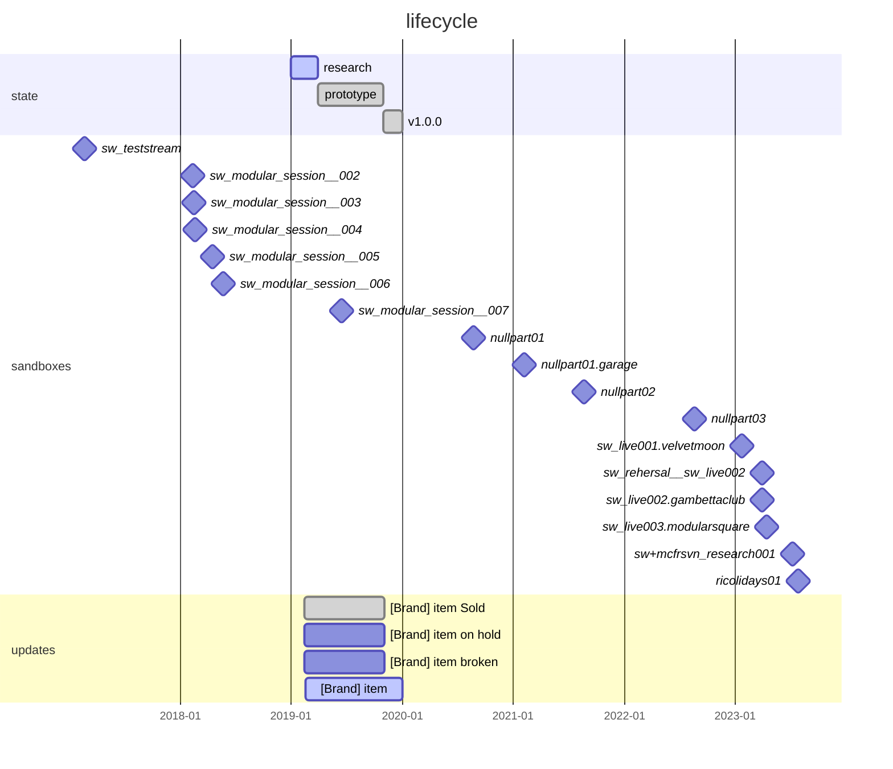

# ELM-%%id%%: "%%Name%%"

## Description

`[REDACTED]`

## Timeline

## History

<h3>v1.0.0 (2019-10-31 -> ?)</h3>

**CHANGELOG:**

- Remove ...
- Add ...

<h3>Previous versions</h3>

<h3>prototype (2019-03-31 -> 2019-10-31)</h3>

**CHANGELOG:**

- Remove ...
- Add ...

