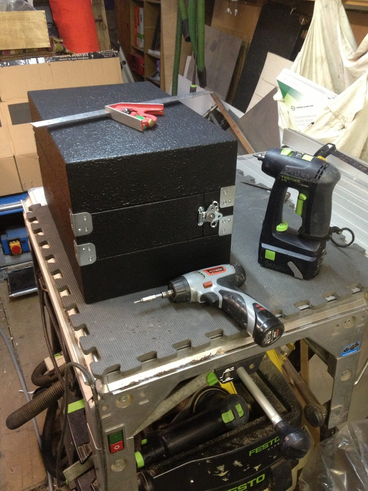
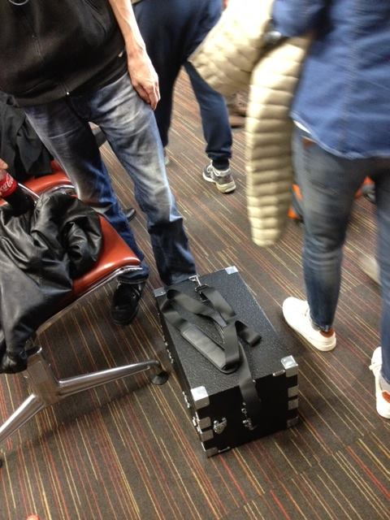
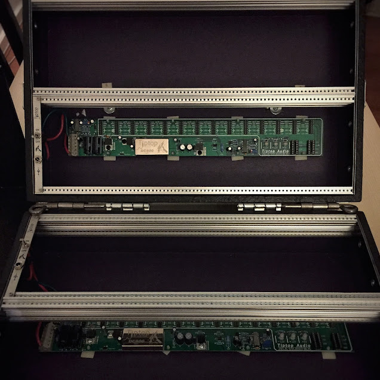

# ELM-0002: "The Black Case"

## History

### 2015-10-27

A picture of a black box with unknown content is
[posted](https://www.facebook.com/938663699559839/photos/a.938703796222496/940987359327473/)
on Arksine's social network page. The box seems to have been made for an
operator called NEMOCAINE. Further research seems to indicate that the operator
is also known as MODGEIST.

### 2015-11-11

A mysterious meeting occurs in a french airport. A picture found on social
networks seem to indicate this could be a transaction between Modgeist and
Arksine.

### 2016-?

Ulterior research confirm that Modgeist is in possession of the black box and
extensively using it. It's purpose is to store and power electronic components
producing sound transmissions and lights. People seem to react positively to
those transmissions, and the box was moved to multiple gigs, including outside
of France.

### 2016-12-14

A year later, B.O.M. surveillance networks log an online chat between
Modgeist and SCHEMATiC WiZARD, the subject seems to be the acquisition of an
empty [Eurorack](https://en.wikipedia.org/wiki/Eurorack) case.

Full archives are missing, but B.O.M. reports indicate that Modgeist had ask
Arksine to build another black case, a bigger one, and the former had to be
sold. A meeting between Modgeist and SW is planned for the next month.

### 2017-01-07

Buying transaction between Modgeist and SW. SW reports this transaction to be
his "first introduction to the modular world". A picture was posted on social
networks a few hours later.

### 2017-02-14

A month later, a first Eurorack module is plugged to the black Eurorack case:
A [Pingable Envelope Generator](https://4mscompany.com/peg.php) (4ms)

### 2017-02-19

5 days later, a second module is plugged into the case, a wavetable sound source
[Braids](https://pichenettes.github.io/mutable-instruments-documentation/modules/braids/)
(Mutable Instruments), bought from operator
[Holmia](https://soundcloud.com/holmia)). Used in combination with a MS-20 mini
to fill the gaps (missing VCA and VCF), the experience is described as "life
changing" by SW, as he witnesses the 0-12V current flow triggering modules and
propagating audio transmissions across the hardware. The sound was described as
"raw, intense, beefy", with textures that SW has never heard live before.

A testing sandbox was dropped as a livestream on Youtube, where the
transmission can still be watched and listened to if you own the link.

`[EDIT]`: The link has been found in the B.O.M. archives, [sw_teststream](https://www.youtube.com/watch?v=6aDBSkdGnxE)

See `[REDACTED]` for more information.

## Specifications

The Black Case is a transportable Eurorack modular synth case with a decent
amount of Eurorack modules plugged in. The module selection has evolved over the
years.

### Case

**Width:** 84HP

**Height:** 4x 3U (6U + 6U)

**PSU:** 2x Cincon-TTA, 100-240V, 2x 4.6A, with 2x IEC C13 <> FR cables

**Power Bus:** 2x [2HP Zeus
Access](https://www.modulargrid.net/e/tiptop-audio-zeus-access) + 2x [Zeus
Studio Bus DC800](https://tiptopaudio.com/zeus-studio-bus/)

The case is made of wood, with classic flight case rough coating, a bit heavy
but resistant. Each 6U part can be used independently. More details about the
case can be found on [Arksine's website](https://arksine.tumblr.com/).

*Usage:* Multipurpose case, in SW's hand it has evolved to host a classic
VCO/FILTER/VCA voicing + sequencing system.

### Content

Current specifications:
[modulargrid](https://www.modulargrid.net/e/racks/view/2015824)

<!-- THIS IS CURRENT VERSION ------------------------------------------------->

<h3>v4.0.1 (2024-04-05 -> ?)</h3>

**CHANGELOG:**

Teensy LC being almost impossible to acquire in 2024 due to shortage of it's
core chip (see [pjrc](https://www.pjrc.com/store/teensylc.html)), at least for a
price inferior to the one of a brand new module, op prefered to acquire another
full Sweet Sixteen MK2, factory made this time.

- Remove Tesseract Modular Sweet Sixteen Mk2 DIY
- Add Tesseract Modular Sweet Sixteen Mk2

<!-- END OF CURRENT VERSION -------------------------------------------------->

<h3>Previous versions</h3>

<h3>v4.0.0 (2024-03-30 -> 2024-04-05)</h3>

**CHANGELOG:**

This is the beginning of a new era thanks to the implementation of i2c in
Nerdseq and the new programmable mappings.

Full i2c support. Introduction of new tactile control interfaces with two Gliss
by Bela. Bringing back O_C and Precision added instead of Voltage Block for
"control random" opportunities.

Sadly, current operator bricked the outdated Sweet Sixteen's Teensy LC due to
poor firmware choice and/or bad soldering. i2c with NerdSEQ expander didn't
work. The sweet sixteen analog features still work but no USB/Midi/i2c
communication is possible. Teensy LC has been removed and kept aside. A new
Teensy LC has been ordered on a Chinese reseller's website for an unspeakable
price.

- Upgrade Nerdseq to V2.01A
- Upgrade Ornament & Crime (x2) Hemisphere Suite to Phazerville Suite 1.7
- Remove Erica Synths Pico Drums
- Remove Takaab 2LPG
- Remove Music Thing Modular Mikrophonie
- Remove Malekko Voltage Block
- Remove XOR Nerdseq IO Expander
- Add Ornament & Crime
- Add Doepfer A-185-2 (Precision Adder)
- Add XOR Nerdseq Multi-IO Expander
- Add Bela Gliss (x2)

<h3>v4.0.0-alpha1 (2023-08-29 -> 2024-03-30)</h3>

**CHANGELOG:**

Preparing a new era thanks to the future i2c support in Nerdseq and the new
programmable mappings.

- Remove Erica Synths Pico DSP
  *--> move to [ELM-0004](../ELM-0004/README.md)*
- Remove Ornament & Crime
- Remove Intellijel µScale
- Remove Doepfer A-185-2 (Precision Adder)
- Add Erica Synths Pico Drums
- Add Tesseract Modular Sweet Sixteen Mk2 DIY
- Upgrade Nerdseq to 1.28beta2

Getting ready for a new Nerseq Multi IO-Expander, previous expander is
used for the time being, without i2c support.

<h3>v3.0.1 (2023-07-20 -> 2023-08-29)</h3>

**CHANGELOG:**

- Remove 2HP Rnd v2
- Remove Doepfer A-180-2
- Add Xaoc Kamieniec

<h3>v3.0.0 (2023-06-20 -> 2023-07-20)</h3>

**CHANGELOG:**

- Remove Music Thing Modular London Drive DIY
  *--> move to [ELM-0004](../ELM-0004/README.md)*
- Remove Music Thing Modular Twin Drive DIY
  *--> move to [ELM-0004](../ELM-0004/README.md)*
- Remove Erica Synths Pico Drums
  *--> move to [ELM-0004](../ELM-0004/README.md)*
- Remove DivKid Mutes (1) DIY
  *--> move to [ELM-0004](../ELM-0004/README.md)*
- Remove DivKid Mutes (2) DIY
  *--> move to [ELM-0004](../ELM-0004/README.md)*
- Remove Music Thing Modular Turing Machine MkII DIY
- Remove Music Thing Modular Pulses DIY
- Add 1010music Bitbox Micro
- Add Erica Synths Pico DSP

<h3>v2.5.0 (2023-01-07 -> 2023-06-20)</h3>

**CHANGELOG:**

- Add Music Thing Modular Twin Drive DIY
- Add Music Thing Modular London Drive DIY

<h3>v2.4.0 (2023-12-10 -> 2023-01-07)</h3>

**CHANGELOG:**

- Remove Make Noise DPO
- Remove Robaux SWT16+
- Add Rossum Electro-Music Trident
- Add Doepfer A-180-2
- Add Intellijel µScale

### Timeline

``` mermaid
gantt
  todayMarker off

  title         lifecycle
  dateFormat    YYYY-MM-DD
  axisFormat    %Y-%m

  section state
  research                   :active,    2016-01-01, 2023-12-31
  case build (pre-bom)       :done,      2015-10-01, 2015-10-27
  case first life (pre-bom)  :done,      2015-11-11, 2017-01-07
  prototype                  :done,      2017-01-07, 2018-03-01
  v1.0.0                     :done,      2018-03-01, 2022-03-01
  v2.4.0                     :done,      2022-12-10, 2023-01-07
  v2.5.0                     :done,      2023-01-07, 2023-06-20
  v3.0.0                     :done,      2023-06-20, 2023-07-20
  v3.0.1                     :done,      2023-07-20, 2023-08-29
  v4.0.0-alpha1              :done,      2023-08-29, 2024-02-10
  v4.0.0                     :active,    2024-02-10, 2024-12-31

  section owner/operator (may contain mistakes)
  arksine            :done,      2015-10-01, 2015-11-11
  nemocaine/modgeist :done,      2015-11-11, 2017-01-07
  schematicwizard    :active,    2017-01-07, 2023-12-31

  section sandboxes
  (non-bom) modgeist career    :milestone, 2016-01-01, 1y
  sw_teststream                :milestone, 2017-02-19, 1d
  sw_modular_session__002      :milestone, 2018-02-11, 1d
  sw_modular_session__003      :milestone, 2018-02-13, 1d
  sw_modular_session__004      :milestone, 2018-02-18, 1d
  sw_modular_session__005      :milestone, 2018-04-16, 1d
  sw_modular_session__006      :milestone, 2018-05-20, 1d
  sw_modular_session__007      :milestone, 2019-06-16, 1d
  nullpart01                   :milestone, 2020-08-14, 2020-08-28
  nullpart01.garage            :milestone, 2021-02-06, 2021-02-07
  nullpart02                   :milestone, 2021-08-14, 2021-08-28
  nullpart03                   :milestone, 2022-08-14, 2022-08-28
  sw_live001.velvetmoon        :milestone, 2023-01-21, 1d
  sw_rehersal__sw_live002      :milestone, 2023-03-31, 1d
  sw_live002.gambettaclub      :milestone, 2023-03-31, 1d
  sw_live003.modularsquare     :milestone, 2023-04-13, 1d
  sw+mcfrsvn_research001       :milestone, 2023-07-07, 2d
  ricolidays01                 :milestone, 2023-07-24, 2023-07-31
  sw+th+briselame+csaoh_jam001 :milestone, 2023-08-10, 1d
  sw_live004.penicheantipode   :milestone, 2023-11-16, 1d
  sw_live005.lamain            :milestone, 2024-02-09, 1d

  section updates
  [Mutable Instruments] Braids                  :active,    2017-02-18, 2024-12-31
  [Mutable Instruments] Veils (v1)              :active,    2017-04-03, 2024-12-31
  [Mutable Instruments] Links                   :active,    2017-04-03, 2024-12-31
  [Doepfer] A-180-2 (multiple)                  :active,    2017-04-03, 2024-12-31
  [Xaoc] Belgrad                                :active,    2017-04-01, 2024-12-31
  [Mutable Instruments] Clouds                  :active,    2017-05-27, 2024-12-31
  [Zvex] Fuzz Factory                           :active,    2017-08-12, 2024-12-31
  [Music Thing Modular] Mikrophonie (2017) DIY  :active,    2017-10-29, 2024-12-31
  [Noise Engineering] Basimilus Iteritas Alter  :active,    2017-12-10, 2024-12-31
  [ALM] Pamela's New Workout                    :active,    2017-12-16, 2024-12-31
  Ornament & Crime                              :active,    2018-03-04, 2024-12-31
  [Erica Synths] Pico Drums                     :active,    2018-04-13, 2024-12-31
  [Malekko] Voltage Block                       :active,    2018-07-24, 2024-12-31
  [Make Noise] Maths                            :active,    2019-02-05, 2024-12-31
  [DivKid] Mutes (1) DIY                        :active,    2019-05-24, 2024-12-31
  [DivKid] Mutes (2) DIY                        :active,    2019-05-24, 2024-12-31
  [Fonitronik] Cascade DIY                      :active,    2019-05-24, 2024-12-31
  [Mutable Instruments] Plaits                  :active,    2019-06-01, 2024-12-31
  [Expert Sleepers] Disting Mk4 (1)             :active,    2019-08-15, 2024-12-31
  [XOR Electronics] Nerdseq                     :active,    2020-11-11, 2024-12-31
  [Robaux] SWT16+ DIY                           :active,    2020-11-11, 2024-12-31
  [Expert Sleepers] ES-8                        :active,    2020-11-11, 2024-12-31
  [2hp] Mix                                     :active,    2020-11-11, 2024-12-31
  [Expert Sleepers] Disting Mk4 (2)             :active,    2020-11-11, 2024-12-31
  [Doepfer] A-124 VCF5 (Wasp Filter)            :active,    2020-11-26, 2024-12-31
  [Doepfer] A-103 VCF6 (Low Pass Filter)        :active,    2020-11-26, 2024-12-31
  [XOR Electronics] Nerdseq IO Expander         :active,    2021-02-03, 2024-12-31
  [Intellijel] Quadrax                          :active,    2021-07-24, 2024-12-31
  [Happy Nerding] FX AID XL                     :active,    2021-07-24, 2024-12-31
  [Befaco] Hexmix                               :active,    2021-07-24, 2024-12-31
  [Befaco] Hexpander                            :active,    2021-07-24, 2024-12-31
  [Joranalogue] Filter 8                        :active,    2021-08-12, 2024-12-31
  [Happy Nerding] FX AID                        :active,    2021-08-12, 2024-12-31
  [Takaab] 2LPG (v2)                            :active,    2021-11-22, 2024-12-31
  [Rossum Electro-Music] Trident                :active,    2022-11-26, 2024-12-31
  [XOR Electronics] Nerdseq Trig16 Expander     :active,    2022-12-07, 2024-12-31
  [Intellijel] µScale                           :active,    2022-12-10, 2024-12-31
  [Doepfer] A-185-2 (Precision Adder)           :active,    2022-12-10, 2024-12-31
  [Xaoc] Kamieniec                              :active,    2023-07-20, 2024-12-31
  [Erica Synths] Pico Input                     :active,    2023-08-29, 2024-12-31
  [Bela] Gliss (1)                              :active,    2024-03-30, 2024-12-31
  [Bela] Gliss (2)                              :active,    2024-03-30, 2024-12-31
  [XOR Electronics] Nerdseq Multi-IO Expander   :active,    2024-03-30, 2024-12-31
  [Tesseract Modular] Sweet Sixteen Mk2         :active,    2024-04-05, 2024-12-31
```

