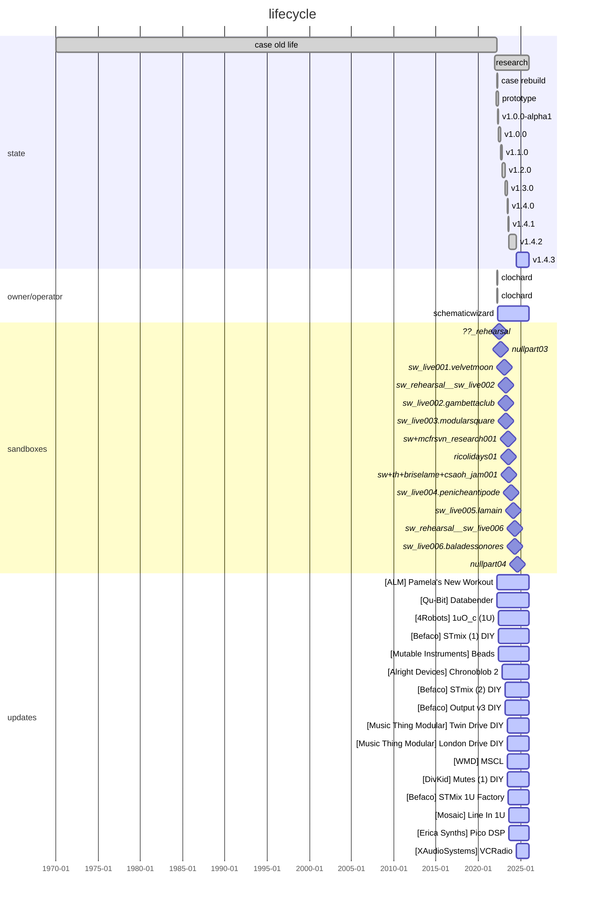

# ELM-0004: "The Yellow Case"

## Description

Mainly focused on sampling, mixing and effects (reverbs, delays, glitchers...).

## History

### ???

TBD

## Specifications

The Yellow Case is a transportable DIY Eurorack modular synth case, with a focus
on output, mixing, amplification, compression and effects. Is can be used
standalone in no-input mode, or with external instruments / eurorack systems.
It can be hold on the back of an operator thanks to shoulder straps made with
seat belts. SCHEMATiC WiZARD's logo is forged at the back of the case.

### Case

TBD

### Content

Current specifications: [modulargrid](https://www.modulargrid.net/e/racks/view/2015824)

<!-- THIS IS CURRENT VERSION ------------------------------------------------->
<h3>v1.4.3 (2024-07-15 -> ?)</h3>

**CHANGELOG:**

Receive Radio.

- Remove DivKid Mutes (2)
- Remove Music Thing Modular London Drive
- Add XAudioSystems VCRadio

<!-- END OF CURRENT VERSION -------------------------------------------------->

<h3>Previous versions</h3>

<h3>v1.4.2 (2023-08-29 -> 2024-07-15)</h3>

**CHANGELOG:**

The operator discovered WMD MSCL's sidechain can be triggered thanks to a simple
trig or an enveloppe, which removes the need from a Pico Drums that is bringing
uneeded latency in the sidechain signal (which is huge in the Pico Drums).

Adding a Line In 1U to boost external drums (Digitakt) to modular levels.

Small improvement of the patch with a new feedback loop (enabling no-input
performances). Modification of Hexpander sends order, using send 2 (PRE, FX Aid)
in combination with post FX (Pico DSP) mixed back in the same return STMix.

Some DSP have been exchanged so the master bus contains a final FX Aid instead
of the Databender (underused), enabling the Lofi tape wobbling FX on the master.
Sanitization of input levels, gain staging and compression to prevent saturation
on the FX Aid and on the Electro Harmonix Platform (master compression)

- Remove Transient Modules u2X 1U DIY
- Remove Erica Synths Pico Drums
  *--> move to [ELM-0002](../ELM-0002/README.md)*
- Add Mosaic Line In 1U
- Add Erica Synths Pico DSP

<h3>v1.4.1 (2023-07-20 -> 2023-08-29)</h3>

**CHANGELOG:**

- Remove Intellijel Switched Multiple 1U
- Remove Intellijel Phones 1U
- Add Befaco STMix 1U for stereo inputs to Hexmix

<h3>v1.4.0 (2023-06-20 -> 2023-07-20)</h3>

**CHANGELOG:**

- Remove Erica Synths Pico DSP
  *--> move to [ELM-0002](../ELM-0002/README.md)*
- Remove Doepfer 1-180-2 (passive multiple)
  *--> move to [ELM-0002](../ELM-0002/README.md)*
- Remove 1010music Bitbox Micro
  *--> move to [ELM-0002](../ELM-0002/README.md)*
- Add WMD MSCL Compressor
- Add Erica Synths Pico Drums for sidechaining the MSCL
- Add Music Thing Modular Twin Drive
- Add Music Thing Modular London Drive
- Add DivKid Mutes x2

<h3>
v1.3.0 (2023-03-11 -> 2023-06-20)
</h3>

**CHANGELOG:**

- Remove Mutable Instruments Veils v2
- Add Befaco Output v3 DIY
- Add Befaco STMix (2) DIY

<h3>
v1.2.0 (2022-10-28 -> 2023-03-11)
</h3>

### Timeline

