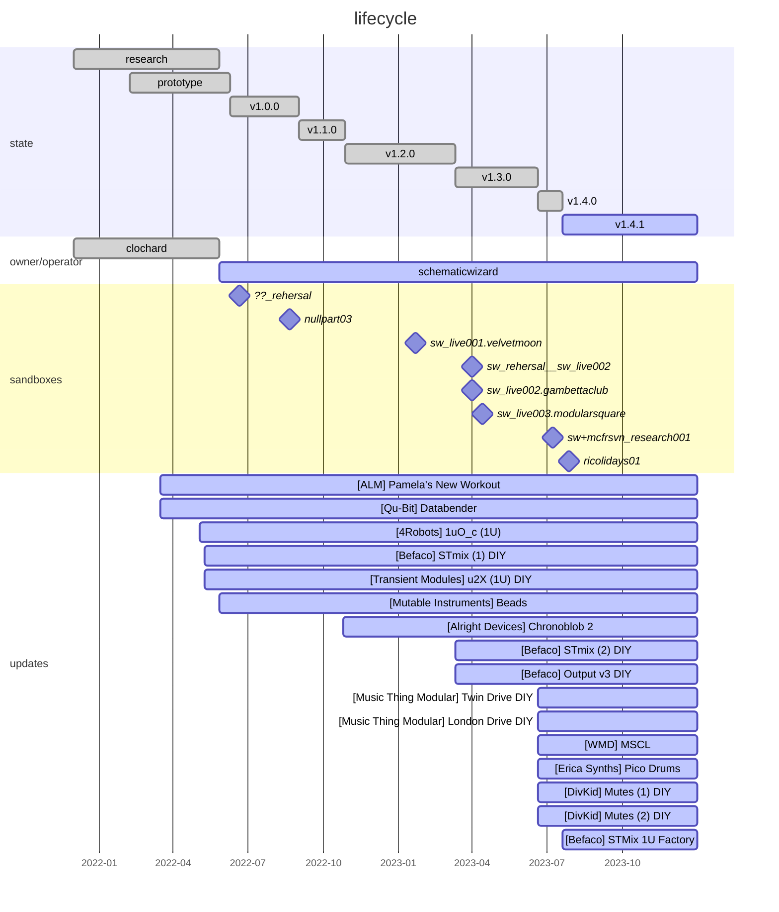

# ELM-0004: "The Yellow Case"

## Description

A DIY Eurorack case made by Clochard.

Mainly focused on sampling, mixing and effects (reverbs, delays, glitchers...).

## Timeline

## History

Current specifications: [modulargrid](https://www.modulargrid.net/e/racks/view/2015824)

<h3>v1.4.1 (2023-07-20 -> ?)</h3>

**CHANGELOG:**

- Remove Intellijel Switched Multiple 1U
- Remove Intellijel Phones 1U
- Add Befaco STMix 1U for stereo inputs to Hexmix

<h3>Previous versions</h3>

<h3>v1.4.0 (2023-06-20 -> 2023-07-20)</h3>

**CHANGELOG:**

- Remove Erica Synths Pico DSP -> move to ELM-0002
- Remove Doepfer 1-180-2 (passive multiple) -> move to ELM-0002
- Remove 1010music Bitbox Micro -> move to ELM-0002
- Add WMD MSCL Compressor
- Add Erica Synths Pico Drums for sidechaining the MSCL
- Add Music Thing Modular Twin Drive
- Add Music Thing Modular London Drive
- Add DivKid Mutes x2

<h3>
v1.3.0 (2023-03-11 -> 2023-06-20)
</h3>

**CHANGELOG:**

- Remove Mutable Instruments Veils v2
- Add Befaco Output v3 DIY
- Add Befaco STMix (2) DIY

<h3>
v1.2.0 (2022-10-28 -> 2023-03-11)
</h3>

