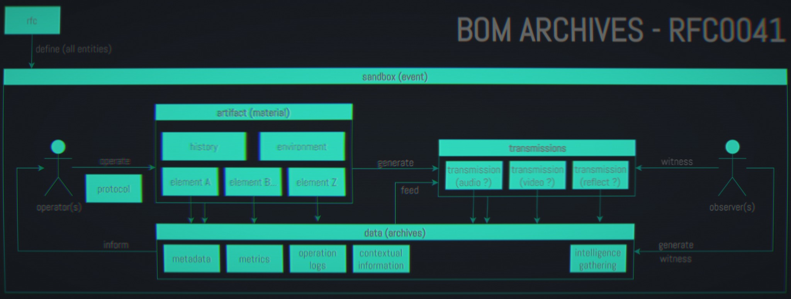

# RFC-0041: "Bill of Materials Entities"

_Bill of Materials_ experiments are focused on studying different entities. If
you were to attend to a public or private gathering near or inside a sandbox of
_Bill of Materials_, it is recommended you study the concepts behind each entity
in order to get a better general understanding of what you will see and know
what to expect.

### artifact (RTF)

An artifact is an object or a small installation with the ability to produce or
transform transmissions. It can be active, passive, inert, animated,
interactive. Each artifact has its own protocol, some of them need an operator
for direct / indirect stimulation. Most artifacts are standalone but some of
them can produce interesting results when combined one with another, which
is a predominant part of the conducted experiments in _Bill of Materials_.
Artifacts are meticulously indexed and defined in the data repository. This
index is a 4 digit number, prefixed by `RTF-`. In some sandboxes they are
prefixed with `fig.`.

### element (ELM)

Subpart of an artifact. May contain extensive information about object's history
and past lives, detailed specifications, technical implementations, firmware and
schematics, operation procedures and transmissions it produces.

### operator (OP)

Generally speaking, an operator is a human being. Some sandboxes may be opened
to other kind of operators (animals, plants, `[REDACTED]`...)

### sandbox

A sandbox is a confined place (as in time and space) where artifacts (and/or
operators) are tested with different protocols. A sandbox can be open to the
public during rare occasions, where the public can also be tested or take part
in the experiment.

### protocol

_(also known as **modus operandi** or **operations**)_ A protocol is a set of
actions an operator conducts on one artifact, during the setup, initialization,
run or ending of an act, most of the time inside a sandbox. According to the
situation and the artifacts, the actions involved in a protocol can be performed
in order, randomly or concern multiple artifacts at the same time. Sometimes,
the operator can chose to call external help to perform its operations.

### transmission

The input and/or output of an artifact. Transmissions are commonly defined by
humans as a sound, music, a noise, a melody, an image, a video, a feeling and
may be experienced by human beings. Transmissions have generally speaking high
entropy but the entropy may be reduced. In those situations we speak of
**scripted transmissions**, where the protocol is clearly predefined or the
artifact configured to have a predictable output. Most of the transmissions
require a protocol to follow in order to be produced.

### reflect

Reflects are a special kind of transmissions. They are produced in a different
space and where  `[REDACTED]` _(archives have been destroyed but it seems to
have a relationship with artifact `RTF-0001`)_

### request for comment (RFC)

Standardisation of B.O.M.
